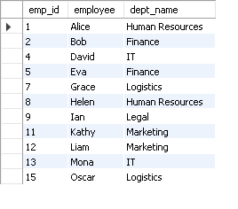
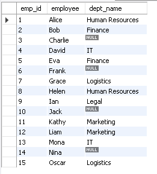
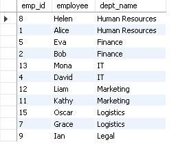
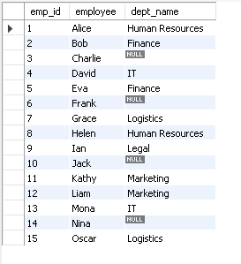

# 🚀 CODTECH Internship – Task 1: SQL JOINs

This repository contains SQL scripts and outputs for **Task 1** of my SQL internship at **CODTECH IT Solutions**.

## 📌 Task Objective

> **Perform INNER, LEFT, RIGHT, and FULL JOINS on tables to combine data meaningfully.**

---

## 📂 Files Included

| File / Folder           | Description |
|-------------------------|-------------|
| `sample_tables.sql`     | Script to create and populate `employees` and `departments` tables |
| `inner_join.sql`        | SQL script for INNER JOIN |
| `left_join.sql`         | SQL script for LEFT JOIN |
| `right_join.sql`        | SQL script for RIGHT JOIN |
| `full_join.sql`         | SQL script to simulate FULL OUTER JOIN using UNION |
| `inner_join.csv`        | Output of INNER JOIN |
| `left_join.csv`         | Output of LEFT JOIN |
| `right_join.csv`        | Output of RIGHT JOIN |
| `full_join.csv`         | Output of FULL OUTER JOIN |
| `screenshots/`          | Folder containing PNG screenshots of all JOIN results |

---

## 🛠️ Technologies Used

- **MySQL** – Database engine
- **MySQL Workbench** – SQL editor & export tool

---

## 🔍 JOIN Examples

### ✅ INNER JOIN

### ✅ LEFT JOIN

### ✅ RIGHT JOIN

### ✅ FULL OUTER JOIN (Simulated using UNION)

---

## 📌 How to Run

1. Import and run `sample_tables.sql` in MySQL Workbench
2. Run each JOIN query file (`inner_join.sql`, etc.)
3. Compare with provided `.csv` outputs and screenshots

---

## 📢 Author

- **Name:** AAYUSH BANSAL  
- **Company Name:** CODTECH IT SOLUTIONS  
- **Intern ID:** CT04DL706  
- **Domain:** SQL  
- **Duration:** 4 WEEKS  
- **Mentor:** NEELA SANTOSH

---

## ✅ Task Status: Completed

✔️ This task is complete and ready for submission!
